## 一、Python Web框架介绍
### 1. 什么是框架
能够帮助你把程序的整体架构搭建好, 让你能够专注于 web 应用上有趣的关键性的逻辑 , 而框架能够在合适的时候调用你写的逻辑, 而不需要我们自己去调用逻辑, 让Web开发变的更敏捷。

### 2. Web框架有哪些
* Django: 重量级的Web框架，功能丰富，灵活性差
* Flask: 轻量级的Web框架，可扩展性强
* Tornado: 轻量级的异步Web框架

## 二、Django介绍
### 1. Django历史
* 源自于一个在线新闻Web站点，于2005年以开源的形式被释放出来。
* 官网：https://www.djangoproject.com/
### 2. Django特点
* 主要目的是简便、快速地开发数据库驱动的网站
* 功能丰富：自带ORM、URL分发、模板系统、表单处理、Cache系统、会话管理、国际化、后台管理
* 可扩展：pypi及git上有很多基于Django开发的应用
### 3. Django优劣
#### a. Django优势* 完美的文档
* 全套的解决方案
* 强大的URL路由配置
* 自助管理后台
#### b. Django劣势
* 系统紧耦合，灵活性差

### 4. 关于性能

* 性能问题最常出现在数据库访问和文件读写上
* 没有一定的访问量前谈性能其实是没有多大意义的
* 人力成本才是最贵的 
## 三、开发环境搭建

### 1. 环境说明
* Windows
* Python3.6
* Django1.11
* MySQL
* PyCharm
### 2. Django安装* pip安装* 源码安装---## 四、请求响应流程### 简版：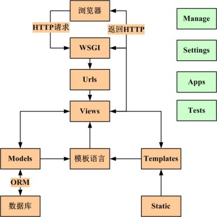### 复杂版：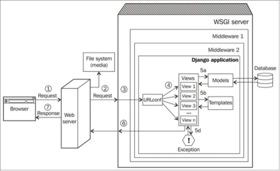前面的图片展示了从一个访客的浏览器到Django应用并返回的一个web请求的简单历程.如下是数字标识的路径：1．浏览器发送请求（基本上是字节类型的字符串）到web服务器2．web服务器（比如，Nginx）把这个请求转交到一个WSGI（比如，uWSGI），或者直接地文件系统能够取出 一个文件（比如，一个CSS文件）3．不像web服务器那样，WSGI服务器可以直接运行Python应用。请求生成一个被称为environ的Ptyhon字典， 而且，可以选择传递过去几个中间件的层，最终，达到Django应用4．URLconf中含有属于应用的urls.py选择一个视图处理基于请求的URL的那个请求，这个请求就已经变成了 HttpRequest——一个Python字典对象5．被选择的那个视图通常要做下面所列出的一件或者更多件事情：A. 通过模型与数据库对话B. 使用模板渲染HTML或者任何格式化过的响应C. 返回一个纯文本响应（不被显示的）D. 抛出一个异常6．HttpResponse对象离开Django后，被渲染为一个字符串7．在浏览器见到一个美化的，渲染后的web页面---## 五、快速入门### 1. 前置知识#### a. 常用命令* django-admin: 常用来创建项目及应用* manage.py： 常用来管理项目，如运行开发环境，数据库操作，用户操作等### 2. 创建项目* 创建项目 ： ```django-admin startproject mysite```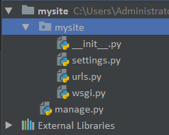* 创建应用： ```cd mysite;django-admin startapp app1```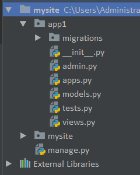### 3. 最简单的URL访问* 编写路由：路由都在urls文件里，它将浏览器输入的url映射到相应的业务处理逻辑。```# mysite/urls.pyfrom django.conf.urls import urlfrom django.contrib import adminfrom app1 import viewsurlpatterns = [ # admin后台路由 url(r'^admin/', admin.site.urls), # 自定义路由 url(r'^demo01/', views.demo01),]``` * 编写业务处理逻辑：业务处理逻辑都在views.py文件里。```# app1/views.pyfrom django.shortcuts import renderfrom django.shortcuts import HttpResponse# request 必填，名字可以修改，封装了用户请求的所有内容def demo01(request): html = '<h1>i am demo01</h1>' print(html) # 此处不能直接return html, 必须返回一个HttpResponse对象 return HttpResponse(html)``` 通过上面两个步骤，我们将demo01这个url指向了views里的demo01函数，它接收用户请求，并返回一个```“<h1>i am demo01</h1>”```字符串。 * 运行web服务命令行：```python manage.py runserver 127.0.0.1:8000 ``` * 浏览器访问a. 404页面Django的错误页，非常重要的排错依据，务必仔细阅读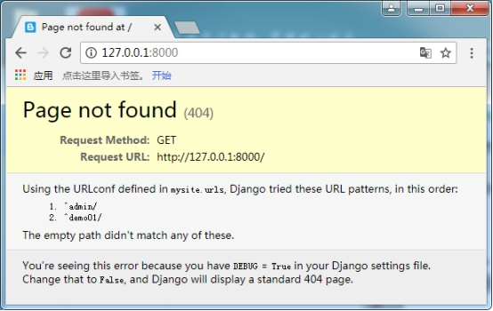 b. 正常访问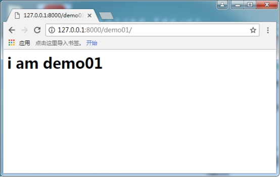 ### 4. 返回HTML文件通常在实际开发中，我们会将html代码与业务逻辑代码分离，这样结构更清晰* 编写html文件我们写这么一个templates/index.html文件，内容来源：http://v3.bootcss.com/getting-started/#templatehttp://v3.bootcss.com/css/#forms```# templates/demo01.py <!DOCTYPE html><html lang="zh-CN"> <head> <meta charset="utf-8"> <meta http-equiv="X-UA-Compatible" content="IE=edge"> <meta name="viewport" content="width=device-width, initial-scale=1"> <!-- 上述3个meta标签*必须*放在最前面，任何其他内容都*必须*跟随其后！ --> <title>Bootstrap 101 Template</title> <!-- Bootstrap --> <link href="/static/css/bootstrap.min.css" rel="stylesheet"> <!-- HTML5 shim and Respond.js for IE8 support of HTML5 elements and media queries --> <!-- WARNING: Respond.js doesn't work if you view the page via file:// --> <!--[if lt IE 9]> <script src="https://cdn.bootcss.com/html5shiv/3.7.3/html5shiv.min.js"></script> <script src="https://cdn.bootcss.com/respond.js/1.4.2/respond.min.js"></script> <![endif]--> </head> <body> <h1>你好，世界！</h1> <div class="col-md-12"> <form> <div class="form-group"> <label for="exampleInputEmail1">Email address</label> <input type="email" class="form-control" id="exampleInputEmail1" placeholder="Email"> </div> <div class="form-group"> <label for="exampleInputPassword1">Password</label> <input type="password" class="form-control" id="exampleInputPassword1" placeholder="Password"> </div> <div class="form-group"> <label for="exampleInputFile">File input</label> <input type="file" id="exampleInputFile"> <p class="help-block">Example block-level help text here.</p> </div> <div class="checkbox"> <label> <input type="checkbox"> Check me out </label> </div> <button type="submit" class="btn btn-default">Submit</button> </form> </div> <!-- jQuery (necessary for Bootstrap's JavaScript plugins) --> <script src="https://cdn.bootcss.com/jquery/1.12.4/jquery.min.js"></script> <!-- Include all compiled plugins (below), or include individual files as needed --> <script src="/static/js/bootstrap.min.js"></script> </body></html>```* 修改views文件添加具体要执行的业务内容```# app1/views.pyfrom django.shortcuts import render def demo01(request): # 参数1固定的，参数2为模块文件，具体可看render源码（最终返回一个HttpResponse对象） return render(request, 'demo01.html')```* 配置Settings为了让django知道我们的html文件在哪里，需要修改settings文件的相应内容.```# mysite/settings.pyTTEMPLATES = [ { 'BACKEND': 'django.template.backends.django.DjangoTemplates', # 修改此处，让Django到这里的目录找html模板文件 'DIRS': [os.path.join(BASE_DIR, 'templates')], 'APP_DIRS': True, 'OPTIONS': { 'context_processors': [ 'django.template.context_processors.debug', 'django.Template.context_processors.request', 'django.contrib.auth.context_processors.auth', 'django.contrib.messages.context_processors.messages', ], }, },]```* 启动web服务，查看结果能够正确找到html文件，但是静态文件似乎没有加载（F12查看）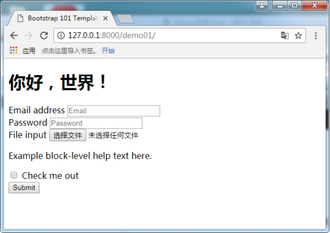 ### 5. 使用静态文件（用bootstrap写一个信息录入页面）在django中，一般将静态文件放在static目录中.接下来，在mysite中新建个static目录并准备好资源.* 准备静态文件Jquery为网络资源Bootstrap相关的为本地资源* 放到./static目录所有静态文件（css/js/imgs）都可以放到这个目录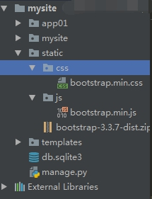  * settings配置站点的配置信息都在这里```# Static files (CSS, JavaScript, Images)# https://docs.djangoproject.com/en/1.11/howto/static-files/STATIC_URL = '/static/'STATICFILES_DIRS = [ os.path.join(BASE_DIR, 'static')]```STATIC_URL是指引用名，不是具体的目录，HTML文件中名字需要与它对应STATICFILES_DIR去这里配置的目录下找静态文件(注意此处为list or tuple否则加载静态文件会报错)* 修改html文件中的引用```# 修改前<link href="css/bootstrap.min.css" rel="stylesheet"><script src="js/bootstrap.Min.js"></script># 修改后<link href="/static/css/bootstrap.min.css" rel="stylesheet"><script src="/static/js/bootstrap.min.js"></script>```* 重新启动web服务，刷新浏览器，查看结果.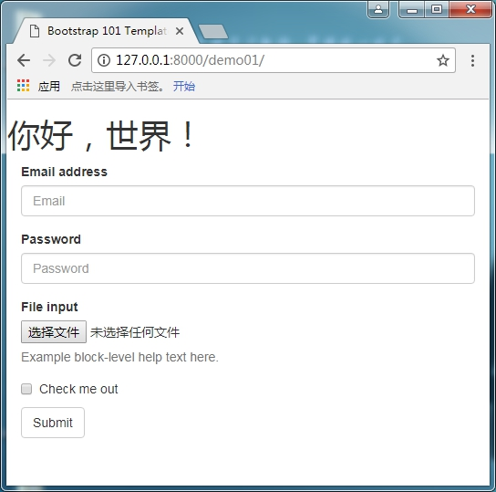  ### 6. 实现表单提交至此，我们已经实现了一个功能完善的html页面，并返回给浏览器.接下来，可以尝试用户与服务器进行数据交互。* 目标：记录用户提交的数据 * 修改模板文件templates/demo01.html可将form表单提交方式分别设置成GET、POST方式```# app1/views.pydef demo01(request): print(request.method) kwgs = {} user_list = [] if request.method == 'POST': username = request.POST.get("username") password = request.POST.get("password") user = {'username':username, 'password':password} user_list.append(user) kwgs = {'user_list': user_list} print(kwgs) return render(request, 'demo01.html')```* POST方式会有一个跨站请求保护机制Post方式提交时，出错，因为django有一个跨站请求保护机制，我们目前可在settings文件中将它关闭。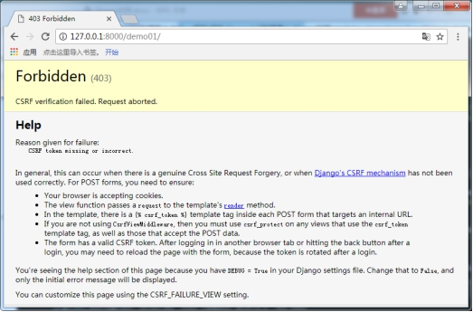 暂时先取消使用这个中间件，后面会详细讲```# mysite/settings.pyMIDDLEWARE = [ 'django.middleware.security.SecurityMiddleware', 'django.contrib.sessions.middleware.SessionMiddleware', 'django.middleware.common.CommonMiddleware', # 'django.middleware.csrf.CsrfViewMiddleware', 'django.contrib.auth.middleware.AuthenticationMiddleware', 'django.contrib.messages.middleware.MessageMiddleware', 'django.middleware.clickjacking.XFrameOptionsMiddleware',]```* 浏览器测试输入用户名，密码，然后我们在pycharm中可以看到相应的数据输出。 ### 7. 返回动态页面我们收到了用户的数据，但返回给用户的依然是个静态页面，通常我们会根据用户的数据，进行处理后在返回给用户。django采用自己的模板语言，类似jinja2，根据提供的数据，替换掉html中的相应部分。* 目标：返回用户提交的数据* 修改app1/views.py中返回数据行为：```return render(request, 'demo01.html', kwgs)``` * 修改templates/demo01.html，添加以下数据``` <hr><h1>所有用户</h1> <table>  <tr> <td>{{ user.username }}</td> <td>{{ user.password }}</td> </tr>  </table>``` * 重启服务，刷新浏览器   ### 8. 与数据库交互目前django的MTV框架基本已经浮出水面了，只剩下最后的数据库部分了。上面我们虽然和用户交互得很好，但并没有保存任何数据，重新访问页面，之前输入的数据都不见了。这时可以使用将数据存储到数据库。Django中可以通过自带的ORM框架操作数据库，并且自带轻量级的sqlite3数据库。* 注册app1不注册它，你的数据库就不知道该给哪个app创建表```#mysite/settings.pyINSTALLED_APPS = [ 'django.contrib.admin', 'django.contrib.auth', 'django.contrib.contenttypes', 'django.contrib.sessions', 'django.contrib.messages', 'django.contrib.staticfiles', 'app1',]```* 配置数据库信息默认使用的是sqlite, 我们可以暂时不修改（它还支持很多，后续会讲）```#mysite/settings.py# Database# https://docs.djangoproject.com/en/1.11/ref/settings/#databases# Sqlie配置DATABASES = { 'default': { 'ENGINE': 'django.db.backends.sqlite3', # 存放路径 'NAME': os.path.join(BASE_DIR, 'db.sqlite3'), }}# MySQL配置DATABASES = { 'default': { 'ENGINE': 'django.db.backends.mysql', 'NAME': 'myblog02', 'USER': 'root', 'PASSWORD': '12345', 'HOST': '192.168.137.200', 'PORT': '3306', 'OPTIONS': { 'init_command': "SET sql_mode='STRICT_TRANS_TABLES'", }, }```注意，遇到报MySQLdb错误，请用以下解决办法：* 方法1：安装mysqlclient* 方法2：安装pymysql，在项目mysite/__init__.py文件添加：```import pymysqlpymysql.install_as_MySQLdb()```* 建立数据库模型```# 编辑app1/models.py(MTV中的M)from django.db import models# 继承models.Model类class UserInfo(models.Model): username = models.EmailField() password = models.CharField(max_length=128)```这里我们创建了2个字段，分别保存用户的邮箱和密码。* 生成建表文件```> python manage.py makemigrationsMigrations for 'app1': app1\migrations\0001_initial.py - Create model UserInfo```* 执行建表操作```> python manage.py migrateOperations to perform: Apply all migrations: admin, app1, auth, contenttypes, sessionsRunning migrations: Applying contenttypes.0001_initial... OK Applying auth.0001_initial... OK Applying admin.0001_initial... OK Applying admin.0002_logentry_remove_auto_add... OK Applying app1.0001_initial... OK Applying contenttypes.0002_remove_content_type_name... OK Applying auth.0002_alter_permission_name_max_length... OK Applying auth.0003_alter_user_email_max_length... OK Applying auth.0004_alter_user_username_opts... OK Applying auth.0005_alter_user_last_login_null... OK Applying auth.0006_require_contenttypes_0002... OK Applying auth.0007_alter_validators_add_error_messages... OK Applying auth.0008_alter_user_username_max_length... OK Applying sessions.0001_initial... OK```* 使用Model```# app1/views.pydef demo01(request): print(request.method) kwgs = {} if request.method == 'POST': username = request.POST.get("username", None) password = request.POST.get("password", None) # 添加数据到库 UserInfo.objects.create(username=username, password=password) # 查询数据 user_list = UserInfo.objects.all() kwgs = {'user_list': user_list} return render(request, 'demo01.html', kwgs)```* 访问结果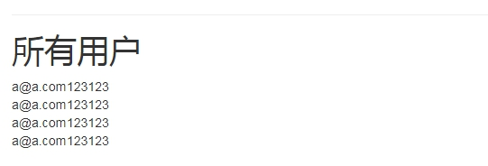 * 小结至此，一个要素齐全，主体框架展示清晰的django项目完成了 ### 9. 访问Admin后台settings.py的INSTALLED_APPS默认帮我们启用了django-admin，如何来访问呢？之前已经将数据结构创建到库里面，现在需要先创建超级用户* 创建超级用户```> python manage.py createsuperuserUsername (leave blank to use 'administrator'): adminEmail address: a@a.comPassword:Password (again):Superuser created successfully.```* 访问后台a. 登录页面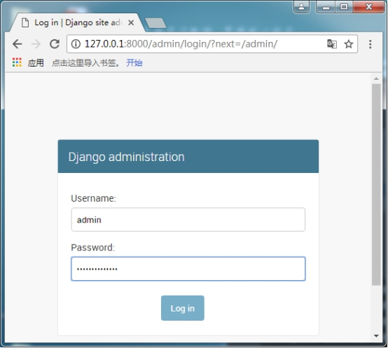 b. 后台首页可以操作添加、删除、修改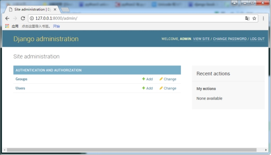  ### 10. 注册Model到Admin* 编辑app1/admin.pyfrom app1.models import UserInfoadmin.site.register(UserInfo)* 访问后台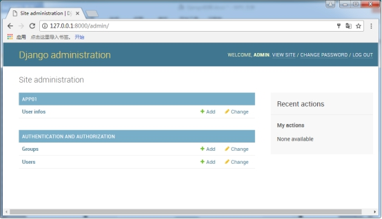 编辑信息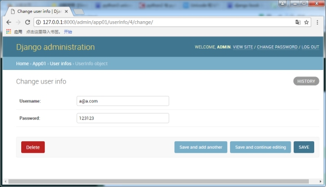  ### 11. 站点中文化* 编辑mysite/settings.py```# LANGUAGE_CODE = 'en-us'LANGUAGE_CODE = 'zh-Hans'# TIME_ZONE = 'UTC'TIME_ZONE = 'Asia/Shanghai'```* 访问后台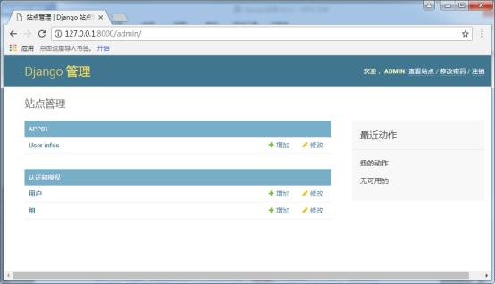 ---## 六、总结### 1. wsgi->settings->url->views->templates->static之间的关系* mysite/wsgi.py：web网关接口会加载settings中的配置信息，此处加载的信息将作用于整个站点```import osfrom django.core.wsgi import get_wsgi_applicationos.environ.setdefault("DJANGO_SETTINGS_MODULE", "mysite.settings")application = get_wsgi_application()```* mysite/settings.py: 此文件用于配置站点需要的所有信息，包括根URL、templates、static等```# 根URL配置ROOT_URLCONF = 'mysite.urls'# 模板配置TEMPLATES = [ { 'BACKEND': 'django.template.backends.django.DjangoTemplates', # 此处添加去哪里寻找html文件(templates目录需要手动创建) 'DIRS': [os.path.join(BASE_DIR, 'templates')], 'APP_DIRS': True, 'OPTIONS': { 'context_processors': [ 'django.template.context_processors.debug', 'django.template.context_processors.request', 'django.contrib.auth.context_processors.auth', 'django.contrib.messages.context_processors.messages', ], }, },]# 静态文件配置# 静态文件的开头标识（好处：方便后期做动静分离）STATIC_URL = '/static/'# 此处添加去哪里寻找静态文件(static目录需要手动创建)STATICFILES_DIRS = [os.path.join(BASE_DIR, 'static')]```* mysite/urls.py: 此文件为默认的URL入口文件（settings中配置的）```from django.conf.urls import urlfrom django.contrib import admin# 导入视图from app1 import views urlpatterns = [ url(r'^admin/', admin.site.urls), # 添加一条url url(r'^demo01/$', views.demo01),]```* app1.views：定义用户视图（核心部分）```from django.shortcuts import render# Create your views here.# request 必填，名字可以修改，封装了用户请求的所有内容def index(request): # 参数1固定的，参数2为模板文件，具体可看render源码（最终返回一个HttpResponse对象） return render(request, 'index.html')```* templates/index.html：模板文件### 2. 学习建议作为python必学web框架的Django，它的功能强大，内容全面，但同时也意味着限制颇多，灵活性低，可修改性差，这就是鱼和熊掌不可兼得了。我们学习Django，其实就是学习一个软件，要理解它的基本原理，把握它整体框架，牢记一些基本规则，剩下的就是不断深入细节，然后熟能生巧、经验多少的问题了，不存在多高深的不可掌握技术。关于学习方法的建议：学习任何东西，不要直接扎入细节，应该先了解它的外围知识，看看它的整体架构，再学习它的基本内容，然后才是深入学习，打磨技巧！  
